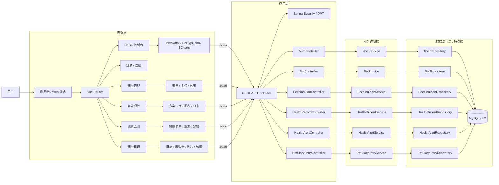
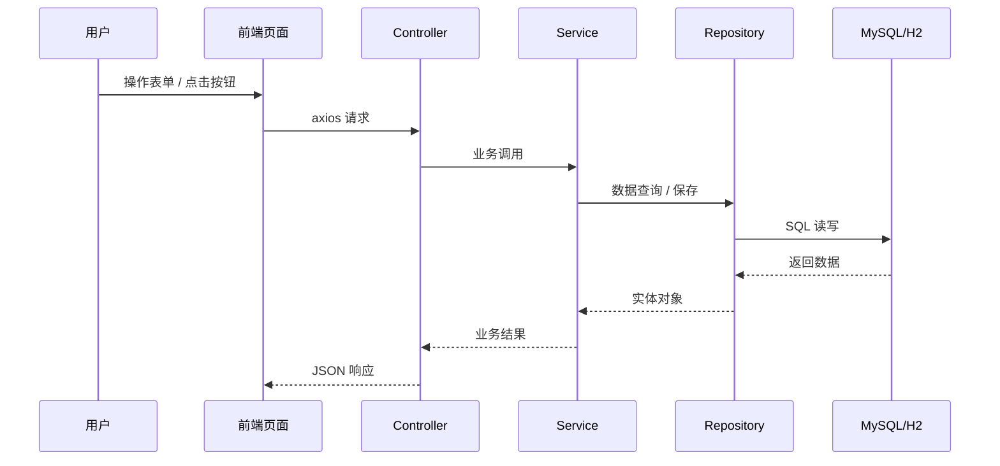

# 宠物喂养系统架构图

## 总体架构

## 分层说明

### 1. 表现层
前端使用 Vue 3 + Vue Router + Axios，主要页面包括：
- `/` 控制台主页
- `/login` 登录
- `/register` 注册
- `/pets` 宠物管理
- `/feeding` 智能喂养
- `/health` 健康监测
- `/diary` 宠物日记

### 2. 应用层
Spring Boot Controller 负责：
- 接收前端请求
- 参数校验与错误返回
- 调用业务层服务
- 统一返回 JSON 响应

### 3. 业务逻辑层
Service 负责核心规则：
- 用户注册、登录
- 宠物 CRUD 与照片、备注保存
- 喂养方案生成
- 健康数据统计、预警标记
- 宠物日记保存、收藏、图片处理

### 4. 持久层
Repository 通过 JPA 访问数据库，当前支持：
- MySQL
- H2（本地临时模式）

## 主要接口清单

| 模块 | 接口 | 方法 | 作用 |
|---|---|---:|---|
| 认证 | `/api/auth/register` | POST | 用户注册 |
| 认证 | `/api/auth/login` | POST | 用户登录 |
| 宠物管理 | `/api/pets` | GET | 获取宠物列表 |
| 宠物管理 | `/api/pets` | POST | 新增宠物 |
| 宠物管理 | `/api/pets/{id}` | GET | 获取单只宠物 |
| 宠物管理 | `/api/pets/{id}` | PUT | 编辑宠物 |
| 宠物管理 | `/api/pets/{id}` | DELETE | 删除宠物 |
| 宠物管理 | `/api/pets/{id}/note` | POST/PATCH | 保存备注与备注图片 |
| 宠物管理 | `/api/pets/{id}/photo` | POST/PATCH | 保存宠物头像 |
| 智能喂养 | `/api/feeding-plan/{petId}` | GET | 获取或生成喂养方案 |
| 健康监测 | `/api/health-records` | POST | 新增健康记录 |
| 健康监测 | `/api/health-records/{petId}` | GET | 获取宠物健康记录 |
| 健康预警 | `/api/health-alerts/{petId}` | GET | 获取健康预警 |
| 健康预警 | `/api/health-alerts/{alertId}/handled` | POST/PATCH | 标记预警已处理 |
| 宠物日记 | `/api/pet-diaries/{petId}` | GET | 获取指定宠物日记 |
| 宠物日记 | `/api/pet-diaries` | POST | 保存日记、图片、收藏状态 |

## 数据表

- `users`
- `pets`
- `feeding_plans`
- `health_records`
- `health_alerts`
- `pet_diary_entries`

## 调用链

